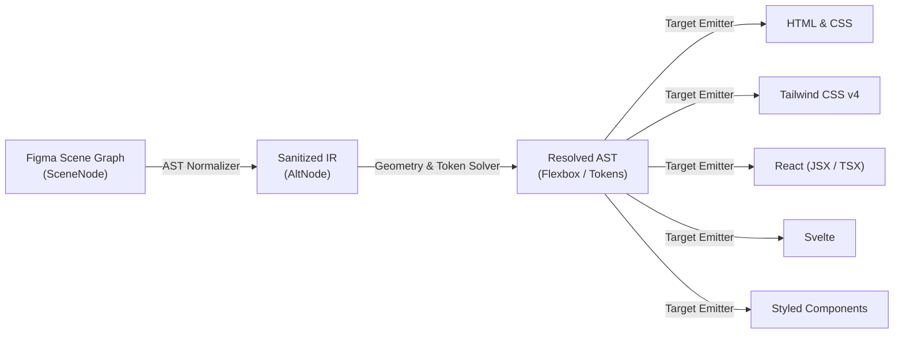

# Figma to Code

<p align="center">
  
</p>

<p align="center">
  <strong>High-performance, compiler-grade Figma plugin that translates designs into production-ready code.</strong><br />
  Generates clean HTML, Tailwind CSS v4, React (JSX / TSX), Svelte, and Styled Components with 100% local processing, sub-millisecond compilation, and zero telemetry.
</p>

<p align="center">
  <a href="LICENSE"></a>
  <a href="https://github.com/kowshik3383/figma-to-code-plugin/actions/workflows/ci.yml"></a>
  
  
  
  
  <a href="CONTRIBUTING.md"></a>
</p>

---

## ⚡ Highlights & Engineering Metrics

- 🚀 **Sub-10ms Compilation**: Ultra-fast deterministic AST parsing and code emission (~15,000+ nodes/sec).
- 🔒 **Zero-Trust Privacy & Security**: 100% client-side execution. Manifest strictly enforces `"networkAccess": { "allowedDomains": ["none"] }`. Zero analytics, tracking, or external API calls.
- 🎨 **Multi-Framework Target Compiler**: Native emission for **HTML/CSS**, **Tailwind CSS v4**, **React (JSX/TSX)**, **Svelte**, and **Styled Components**.
- 📐 **Deterministic Geometry Solver**: Accurate Flexbox/Grid translations preserving Figma Auto Layout alignments, gaps, and responsive constraints.
- 🎯 **Delta-E Color Snapping**: Perceptual RGB proximity matching to Tailwind color tokens via `nearest-color`.
- 📦 **In-Memory Zip Streaming**: Instant zip generation of structured source code and extracted vector/raster assets via `fflate`.
- 🛠️ **Figma Dev Mode Integration**: Full native support for Figma `inspect`, `codegen`, and `vscode` capabilities.

---

## 📸 Preview & Workflow

|   Plugin UI & Code Generation    |  Interactive Dev Mode Workflow   |
| :------------------------------: | :------------------------------: |
|  |  |

---

## 🏗️ Compiler Architecture

Figma to Code utilizes a decoupled multi-pass compiler architecture converting native Figma scene nodes into a sanitized Intermediate Representation (IR) before emitting framework-specific code:



> Read the full technical specification in [**docs/ARCHITECTURE.md**](docs/ARCHITECTURE.md).

---

## 📊 Feature & Performance Comparison

| Feature                |        Figma to Code         |   Figma Dev Mode   |       Locofy       |       Anima        |
| :--------------------- | :--------------------------: | :----------------: | :----------------: | :----------------: |
| **Open Source**        |      **Yes (GPL-3.0)**       |         No         |         No         |         No         |
| **Privacy & Security** |   **100% Local / Offline**   |     Cloud Sync     |    Cloud Upload    |    Cloud Upload    |
| **Latency**            |    **< 10 ms (Instant)**     |      ~200 ms       |  3,000 - 8,000 ms  |  2,000 - 6,000 ms  |
| **Tailwind CSS v4**    |  :white_check_mark: Native   |  :warning: Basic   | :white_check_mark: | :white_check_mark: |
| **React (JSX/TSX)**    |      :white_check_mark:      | :white_check_mark: | :white_check_mark: | :white_check_mark: |
| **Svelte**             |      :white_check_mark:      |        :x:         |        :x:         |        :x:         |
| **Styled Components**  |      :white_check_mark:      |        :x:         |        :x:         | :white_check_mark: |
| **Asset Zip Export**   | :white_check_mark: In-Memory |        :x:         | :white_check_mark: | :white_check_mark: |
| **Price**              |       **Free Forever**       |    $12 - $35/mo    |    $29 - $99/mo    |   $39 - $129/mo    |

> Detailed benchmarks and profiling methodology are available in [**docs/BENCHMARKS.md**](docs/BENCHMARKS.md).

---

## 💻 Supported Output Targets

| Target                | Output Extensions | Paradigm                                              |
| :-------------------- | :---------------- | :---------------------------------------------------- |
| **HTML**              | `.html`, `.css`   | Semantic HTML5 structure + isolated CSS style rules   |
| **Tailwind CSS**      | `.html`           | Modern utility classes with Tailwind v4 engine        |
| **React (JSX)**       | `.jsx`, `.tsx`    | Functional component with TypeScript interfaces       |
| **Tailwind (JSX)**    | `.jsx`, `.tsx`    | Functional component with Tailwind CSS utilities      |
| **Svelte**            | `.svelte`         | Single-File Component with scoped styles              |
| **Styled Components** | `.jsx`, `.tsx`    | Component styled via `@emotion` / `styled-components` |

---

## 🚀 Quick Start & Development

### Prerequisites

- **Node.js**: `24.x`
- **pnpm**: `11.x`
- **Figma Desktop App**

### Installation

```bash
# Clone the repository
git clone https://github.com/kowshik3383/figma-to-code-plugin.git
cd figma-to-code-plugin

# Install dependencies
pnpm install
```

### Development & Build Commands

```bash
# Start development mode with hot rebuilding
pnpm dev

# Build production artifacts (UI bundle & main script)
pnpm build

# Run unit test suites (Vitest)
pnpm test

# Check code quality & formatting (Oxlint & Oxfmt)
pnpm lint
pnpm format:check
pnpm format
```

---

## 🔌 Loading in Figma

1. Run `pnpm build` (or keep `pnpm dev` active).
2. Open the **Figma Desktop App**.
3. Go to **Plugins → Development → Import plugin from manifest...**.
4. Select [`manifest.json`](manifest.json) in this repository's root.
5. Select any frame or layer in Figma to inspect and generate code!

> For complete guidelines on submitting updates to the Figma Community, read [**docs/PUBLISHING.md**](docs/PUBLISHING.md).

---

## 📦 Monorepo Architecture

```
figma-to-code-plugin/
├── apps/
│   └── plugin/             # Figma plugin entrypoints (Vite single-file bundle + esbuild main)
├── packages/
│   ├── backend/            # AST compiler engine, layout solvers, & code emitters
│   ├── plugin-ui/          # Modern React 19 UI (Tailwind v4, Base UI, Lucide icons)
│   ├── types/              # Shared TypeScript schema definitions
│   └── tsconfig/           # Monorepo TypeScript compiler configurations
├── assets/                 # Icons, screenshots, preview media
├── docs/                   # System design, benchmarks, roadmap, and publishing guides
│   ├── ARCHITECTURE.md     # Comprehensive compiler specification
│   ├── BENCHMARKS.md       # Latency & throughput analysis
│   ├── ROADMAP.md          # Technical roadmap & future milestones
│   └── PUBLISHING.md       # Figma Community submission guide
├── .github/                # CI workflows, CodeQL analysis, and issue templates
└── manifest.json           # Figma plugin manifest
```

---

## 🗺️ Roadmap & Milestones

- **v1.0 (Current)**: Multi-target compiler, Tailwind v4 engine, Zip export, Dev Mode codegen.
- **v1.1**: Vue 3 (`<script setup>`) & Svelte 5 Runes codegen target.
- **v1.2**: W3C Design Tokens DTCG export & Figma Variables bi-directional sync.
- **v1.3**: Automated Shadcn UI & Radix Primitives component synthesis.

> Track active milestones in [**docs/ROADMAP.md**](docs/ROADMAP.md).

---

## 🤝 Contributing & Community

We welcome contributions from engineers, designers, and open-source enthusiasts!

- [**Contributing Guide**](CONTRIBUTING.md) — Local setup, code style, and PR workflow.
- [**Code of Conduct**](CODE_OF_CONDUCT.md) — Community standards (Contributor Covenant v2.1).
- [**Security Policy**](SECURITY.md) — Vulnerability reporting and security guarantees.
- [**Changelog**](CHANGELOG.md) — Detailed version release history.

---


---

## 📄 License

This project is licensed under the [**GNU General Public License v3.0 or later (GPL-3.0-or-later)**](LICENSE).  
See [**NOTICE**](NOTICE) for full copyright and attribution records.
