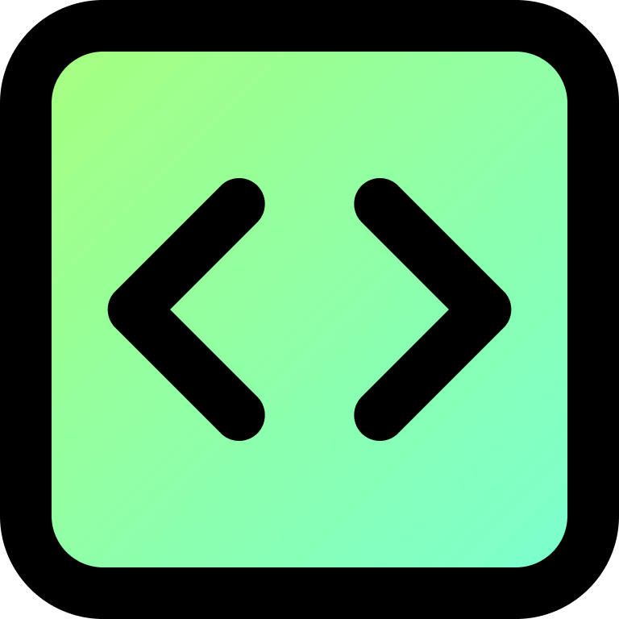
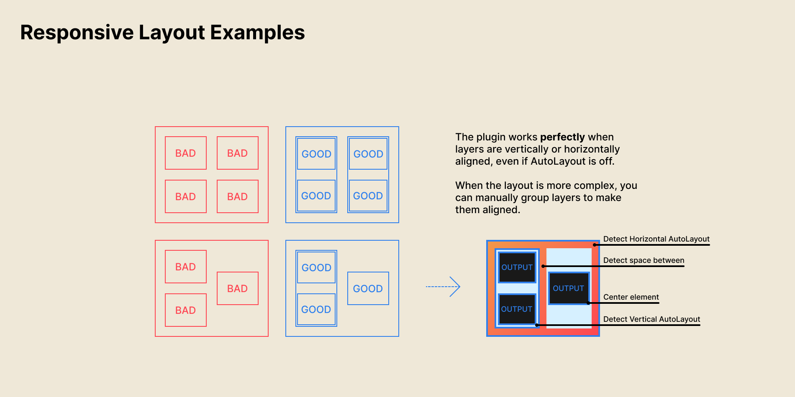
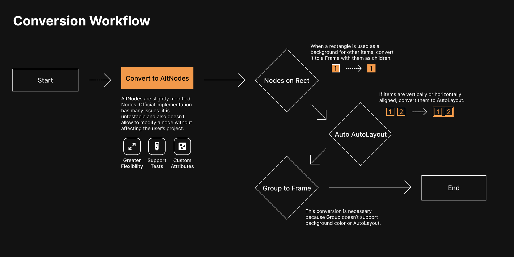

# Figma to Code

<p align="center">
  
</p>

<p align="center">
  <strong>Generate clean, production-ready code directly from your Figma designs.</strong><br />
  Supports HTML, Tailwind CSS, React (JSX / TSX), Svelte, and Styled Components — with 100% local processing and zero telemetry.
</p>

<p align="center">
  <a href="LICENSE"></a>
  <a href="https://github.com/kowshik3383/figma-to-code-plugin/actions/workflows/ci.yml"></a>
  
  <a href="CONTRIBUTING.md"></a>
</p>

---

## Highlights & Features

- ⚡ **Instant Codegen**: Convert Figma frames, components, and auto-layout groups into clean, semantic markup.
- 🎨 **Multiple Framework Targets**:
  - **HTML & CSS**: Standard markup with extracted CSS styles.
  - **Tailwind CSS**: Modern utility classes matching typography, colors, padding, and flex layouts.
  - **React (JSX / TSX)**: Clean JSX components ready to drop into your React apps.
  - **Tailwind (JSX)**: JSX structured with Tailwind utility classes.
  - **Svelte**: Semantic Svelte markup and scoped style blocks.
  - **Styled Components**: React components with `styled.*` CSS-in-JS blocks.
- 🛠️ **Dev Mode & Codegen Ready**: Seamless integration with Figma's Dev Mode (`inspect`, `codegen`, and `vscode`).
- 📦 **Zip Export**: One-click download of generated source files and extracted vector/raster assets.
- 🔒 **100% Local & Private**: No analytics, no external servers, no tracking. Manifest enforces `"networkAccess": { "allowedDomains": ["none"] }`.
- 🔍 **Debug Helper**: Built-in JSON node inspector for debugging complex layer trees.

---

## Preview

|         Plugin Interface         |             Workflow             |
| :------------------------------: | :------------------------------: |
|  |  |

---

## Supported Output Targets

| Target                | Output Format             | Description                                            |
| --------------------- | ------------------------- | ------------------------------------------------------ |
| **HTML**              | `.html` / `.css`          | Semantic HTML with vanilla CSS styling                 |
| **Tailwind**          | `.html` / utility classes | HTML markup styled using Tailwind CSS classes          |
| **React (JSX)**       | `.jsx` / `.tsx`           | React functional component with embedded styles        |
| **Tailwind (JSX)**    | `.jsx` / `.tsx`           | React functional component styled with Tailwind        |
| **Svelte**            | `.svelte`                 | Single-file Svelte component with scoped styles        |
| **Styled Components** | `.jsx` / `.tsx`           | React component using `@emotion` / `styled-components` |

---

## Getting Started

### Prerequisites

- **Node.js**: `24.x` (LTS recommended)
- **pnpm**: `11.x`
- **Figma Desktop App**

### Installation

```bash
# Clone the repository
git clone https://github.com/kowshik3383/figma-to-code-plugin.git
cd figma-to-code-plugin

# Install dependencies
pnpm install
```

### Build & Development

```bash
# Build the plugin bundles (main thread & UI)
pnpm build

# Start development mode with hot reload & watch
pnpm dev

# Run unit tests
pnpm test

# Lint and check code formatting
pnpm lint
pnpm format:check
```

---

## Loading the Plugin in Figma

1. Run `pnpm build` (or have `pnpm dev` running).
2. Open the **Figma Desktop App**.
3. Open any file and navigate to **Plugins → Development → Import plugin from manifest...**.
4. Select the [`manifest.json`](manifest.json) file in the root of this repository.
5. Select any layer or frame in Figma to start generating code!

> For complete instructions on submitting to the Figma Community, read [docs/PUBLISHING.md](docs/PUBLISHING.md).

---

## Monorepo Architecture

```
figma-to-code-plugin/
├── apps/
│   └── plugin/             # Figma plugin runtime (plugin-src/code.ts + Vite webview UI)
├── packages/
│   ├── backend/            # Core translation AST engine & framework generators
│   ├── plugin-ui/          # Modern React 19 UI components (Tailwind v4, Base UI)
│   ├── types/              # Shared TypeScript definitions & schemas
│   └── tsconfig/           # Shared TypeScript configurations
├── assets/                 # Icons, screenshots, and visual media
├── docs/                   # Community publishing and architecture guides
├── .github/                # CI workflows, issue templates, and PR template
└── manifest.json           # Figma plugin manifest configuration
```

---

## FAQ & Troubleshooting

### Is my design data sent to any third-party server?

**No.** All processing happens strictly in the local sandboxed environment within Figma. The manifest explicitly disables network communication (`"allowedDomains": ["none"]`).

### Why is a layer not rendering as expected in the generated code?

Ensure that parent frames use **Auto Layout** in Figma. The layout engine maps Auto Layout properties (direction, alignment, spacing, padding) directly to Flexbox/Grid CSS and Tailwind classes.

### How do I report an issue with a specific Figma frame?

1. Open the plugin inside Figma.
2. Go to the **About** tab.
3. Click **Copy Selection JSON** in the _Debug Helper_ card.
4. Open a [Bug Report](https://github.com/kowshik3383/figma-to-code-plugin/issues/new?template=bug_report.yml) and paste the JSON snippet.

---

## Community & Contributing

We welcome contributions of all kinds! Please check out:

- [Contributing Guide](CONTRIBUTING.md) — Setup guidelines, code standards, and PR process.
- [Code of Conduct](CODE_OF_CONDUCT.md) — Community standards and pledge.
- [Security Policy](SECURITY.md) — Responsible vulnerability disclosure.
- [Changelog](CHANGELOG.md) — Release notes and version history.

---

## License

This project is licensed under the [**GNU General Public License v3.0 or later (GPL-3.0-or-later)**](LICENSE).
See [NOTICE](NOTICE) for full copyright and attribution records.
