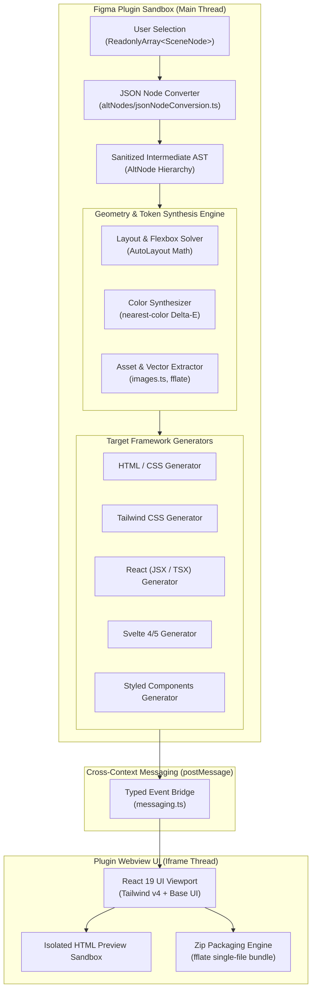

# System Architecture & Compiler Specification

This document provides a deep architectural overview of **Figma to Code**, detailing the compiler pipeline, AST representation, layout geometry solver, color synthesis algorithms, and process sandboxing model.

---

## 1. High-Level System Architecture

Figma to Code is built on a multi-tier compiler architecture that decouples Figma's proprietary scene graph from target syntax generators through a sanitized Intermediate Representation (IR).



---

## 2. Compiler Pipeline Phases

The transformation pipeline executes in discrete, deterministic phases:

```mermaid
sequenceDiagram
    autonumber
    actor User as Designer / Engineer
    participant Main as Figma Main Sandbox
    participant AST as AST Normalizer
    participant Layout as Layout Solver
    participant Token as Token Synthesizer
    participant Emitter as Target Code Emitter
    participant UI as Webview UI (React 19)

    User->>Main: Select Figma Layer / Frame
    Main->>Main: Verify node count (&lt; 4000 limit)
    Main->>AST: nodesToJSON(selection, settings)
    AST->>AST: Strip recursive parents, normalize transforms
    AST->>Layout: Compute Flexbox / Grid constraints
    Layout->>Token: Resolve Colors, Typography & Radii
    Token->>Emitter: convertToCode(sanitizedAST, settings)
    Emitter->>Main: Formatted code string + asset blobs
    Main->>UI: postMessage({ type: 'code', code, metrics, ... })
    UI->>User: Display syntax-highlighted code + live preview
```

### Phase 1: AST Normalization & Tree Pruning (`nodesToJSON`)

Figma's native `SceneNode` instances contain circular references (`node.parent`), lazy getters, and asynchronous property accessors. The normalizer:

1. Clones node data into an immutable JSON representation.
2. Extracts styled text segments asynchronously (`getStyledTextSegmentsAsync`).
3. Strips cycles to enable zero-copy postMessage transfers.
4. Normalizes coordinate spaces from absolute canvas space to local parent space:
   $$\vec{P}_{\text{local}} = \vec{P}_{\text{node}} - \vec{P}_{\text{parent}}$$

### Phase 2: Layout & Geometry Solver

Figma's **Auto Layout** model is translated into standard CSS Flexbox / Grid semantics:

| Figma Auto Layout Property        | Computed CSS Flexbox Equivalent          | Tailwind CSS v4 Utility |
| :-------------------------------- | :--------------------------------------- | :---------------------- |
| `layoutMode: 'HORIZONTAL'`        | `display: flex; flex-direction: row;`    | `flex flex-row`         |
| `layoutMode: 'VERTICAL'`          | `display: flex; flex-direction: column;` | `flex flex-col`         |
| `primaryAxisAlignItems: 'CENTER'` | `justify-content: center;`               | `justify-center`        |
| `counterAxisAlignItems: 'CENTER'` | `align-items: center;`                   | `items-center`          |
| `layoutAlign: 'STRETCH'`          | `align-self: stretch;`                   | `self-stretch`          |
| `layoutGrow: 1`                   | `flex-grow: 1; flex-basis: 0;`           | `grow flex-1`           |
| `itemSpacing: 16`                 | `gap: 16px;`                             | `gap-4`                 |

### Phase 3: Token Synthesis & Delta-E Color Distance

Colors are parsed from Figma RGBA $([0, 1])$ space into standard 8-bit hex codes. When Tailwind mode is enabled:

1. The **`nearest-color`** matcher computes perceptual color distance using the Euclidean RGB distance formula:
   $$d = \sqrt{(\Delta R)^2 + (\Delta G)^2 + (\Delta B)^2}$$
2. Exact hex values within the configured `thresholdPercent` are snapped to standard Tailwind palette tokens (e.g., `#3b82f6` $\to$ `bg-blue-500`).
3. Colors outside the threshold fallback to arbitrary value syntax (e.g., `bg-[#1a2b3c]`).

### Phase 4: Framework-Specific Emission

The emitter walks the resolved AST and formats code for the selected framework:

- **HTML / CSS**: Generates semantic elements (`<header>`, `<main>`, `<button>`, `<div>`) paired with a CSS class block.
- **Tailwind**: Embeds utility classes directly into `class="..."` or `className="..."`.
- **React (JSX / TSX)**: Emits functional components with TypeScript interfaces and clean prop bindings.
- **Svelte**: Emits Svelte single-file components with scoped `<style>` blocks.
- **Styled Components**: Emits `@emotion/styled` template literals.

---

## 3. Sandboxing & Memory Isolation

To comply with Figma's strict security guidelines:

- **Main Thread Sandbox**: Runs under QuickJS. No DOM access, no network access (`allowedDomains: ["none"]`).
- **UI Iframe Sandbox**: Runs modern browser DOM with strict origin isolation. All external assets are packaged as inlined base64 data URIs or zip blobs.
- **Backpressure & Large Selection Guard**:
  - Selections exceeding `1,200` nodes automatically disable heavy preview rendering.
  - Hard cap at `4,000` nodes prevents plugin crash and memory exhaustion.

---

## 4. Monorepo Package Topology

```
packages/
├── types/          # Zero-dependency schema contracts & shared message interfaces
├── tsconfig/       # Strict TypeScript 7 configuration bases
├── backend/        # Pure compiler core: AST normalizer, layout solvers, framework emitters
└── plugin-ui/      # View layer: React 19, Tailwind v4, Base UI, Lucide icons
apps/
└── plugin/         # Host shell: Vite single-file bundler + esbuild main thread runtime
```
