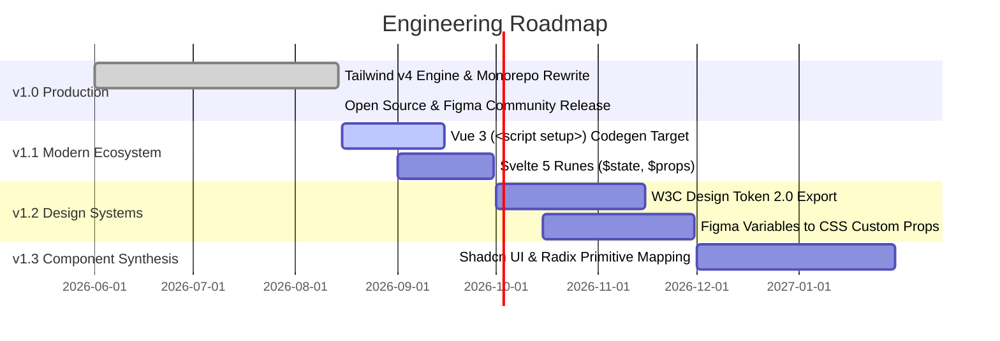

# Technical Roadmap & Engineering Milestones

This document tracks the technical evolution, planned features, and architectural milestones for **Figma to Code**.

---

## Milestone Matrix

---

## 🎯 v1.0.x — Current Stable Release

- [x] Monorepo architecture with Turborepo & pnpm workspaces.
- [x] Multi-target compiler: HTML, Tailwind CSS, React (JSX/TSX), Svelte, Styled Components.
- [x] Modern UI redesign (React 19 + Tailwind v4 + Base UI).
- [x] In-memory Zip asset export engine via `fflate`.
- [x] Dev Mode & Codegen inspector integration (`inspect`, `codegen`, `vscode`).
- [x] 100% offline & zero network access policy.
- [x] CI/CD pipelines with automated GitHub Releases on push.

---

## 🚀 v1.1.0 — Framework Modernization _(Target: Q3 2026)_

- [ ] **Vue 3 Composition API Target**:
  - Clean Single File Components (`.vue`) using `<script setup lang="ts">`.
  - Scoped CSS or Tailwind utilities.
- [ ] **Svelte 5 Runes Upgrade**:
  - Full support for `$state()`, `$derived()`, and `$props()` runes.
- [ ] **Next.js & Astro Component Presets**:
  - Automated `next/image` tag transformations for detected bitmap assets.
  - Image responsive sizing (`srcset` / `sizes`).

---

## 💎 v1.2.0 — Design Tokens & Variables 2.0 _(Target: Q4 2026)_

- [ ] **W3C Design Tokens Community Group (DTCG) Export**:
  - Export color, spacing, typography, and elevation tokens to standard `.tokens.json`.
- [ ] **Figma Variables Resolution**:
  - Dynamic translation of Figma Variable modes (Light / Dark) into CSS Custom Properties (`--primary: ...;`).
  - Tailwind semantic alias linking (e.g. `bg-[var(--bg-card)]`).

---

## ⚡ v1.3.0 — Component Synthesis _(Target: Q1 2027)_

- [ ] **Shadcn UI / Radix Primitives Mapping**:
  - Intelligent heuristics detecting Button, Dialog, Card, Input, and Accordion components.
  - Generates ready-to-use Shadcn UI JSX/TSX syntax.
- [ ] **Interactive States Detection**:
  - Automatic synthesis of `:hover`, `:active`, and `:focus-visible` pseudo-classes based on Figma component variants.

---

## Contributing to the Roadmap

Proposals and feature discussions are welcomed in [GitHub Discussions](https://github.com/kowshik3383/figma-to-code-plugin/discussions) and [Issue Templates](.github/ISSUE_TEMPLATE/).
